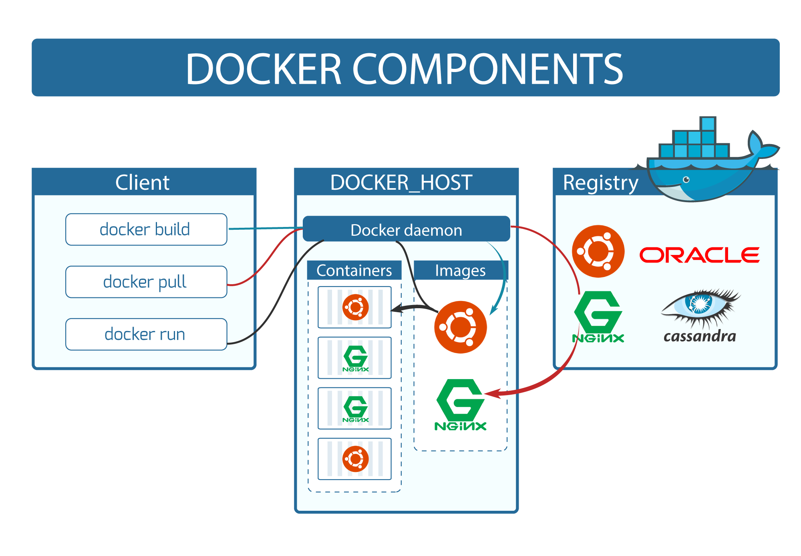
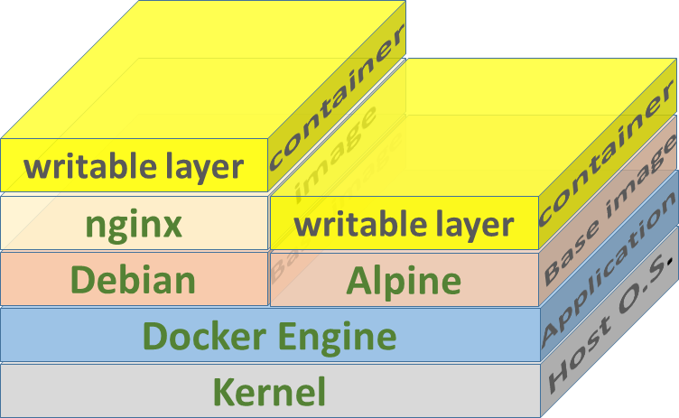
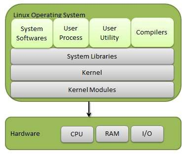
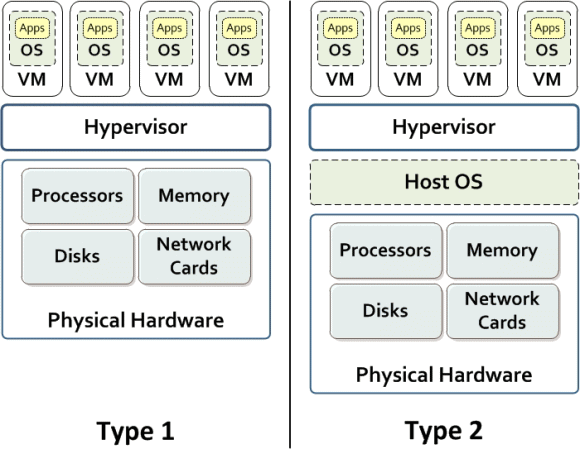
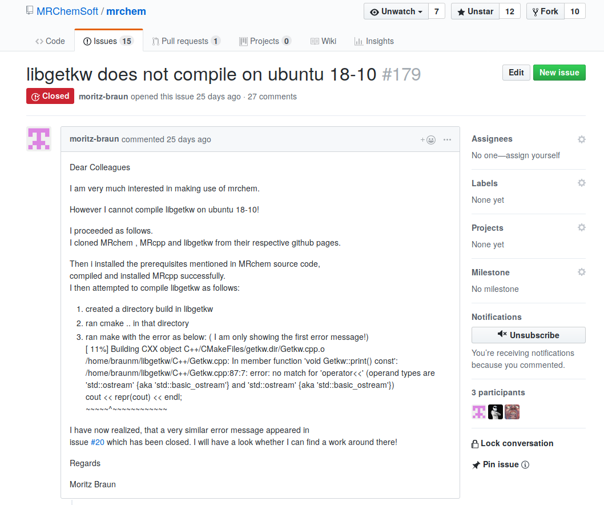
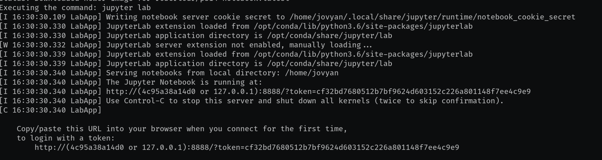

name: inverse
layout: true
class: center, middle, inverse
---

background-image: url(img/yoshimi.jpg)
class: background

## Docker battles the (pink) virtual machines

<!-- 
<p style="text-align:center;"></p>
<p style="clear: both;">
-->

.author[Roberto Di Remigio]

.date[21 January 2019, Haraldvollen]

.footnote[[CC BY 4.0](https://creativecommons.org/licenses/by/4.0/) licensed.
Browse slides at [tinyurl.com/pinkdocker](https://tinyurl.com/pinkdocker)]

???

- Add Docker whale

---

layout: false
.left-column[
  ## What is it?
]
.right-column[
- An _image_ build tool
- A _container_ management tool

<p style="text-align:center;"></p>
<p style="clear: both;">
]

---

layout: false
.left-column[
  ## What is it?
]
.right-column[
- An _image_ build tool
- A _container_ management tool

<p style="text-align:center;"></p>
<p style="clear: both;">
]

---

layout: false
.left-column[
  ## What is it?
]
.right-column[
- An _image_ build tool
- A _container_ management tool

<p style="text-align:center;"></p>
<p style="clear: both;">
]

---

layout: false
.left-column[
  ## What is it?
  ## Why should I care?
]
.right-column[
- Reproducibility
- Shipping your applications
- Running services in isolation
- Reproducibility

<p style="text-align:center;"></p>
<p style="clear: both;">
]

???

- Add figure explaining how Docker stacks on the OS
- Add hypnotoad gif saying "Reproducibility"

---

layout: false

## What does the OS do?

.left-column[
<p style="text-align:left;"></p>
<p style="clear: both;">
]
.right-column[
<p style="text-align:right;"></p>
<p style="clear: both;">
]

???

- Add RanXerox picture

---
layout: false

## Why not Virtual Machines?



---
layout: false

##  HaaS: "Hello, world"-as-a-Service

Let's build our first Docker image

<p style="text-align:center;"></p>
<p style="clear: both;">

```Dockerfile
FROM ubuntu:18.04
CMD ["bash", "-c", "echo 'Hello, world!"]
```

- `docker build -tag simple-hello .`
- `docker images`
- `docker run simple-hello`

???

- Not very useful! It only says "Hello, world!"
- Explain options
- Then move to terminal

---

## User says: "Can't compile/Tests fail/Can't run"

<p style="text-align:center;"></p>
<p style="clear: both;">

---

## User says: "Can't compile/Tests fail/Can't run"

.left[
### For users
]
.right[
### Dear user, please try the code in a Docker container 

```
docker run --rm -it -v "$PWD":/home/mightybuilder/work mrchemsoft/mrchem_ubuntu-18.04
```
]

<p style="text-align:center;"></p>
<p style="clear: both;">

---

## User says: "Can't compile/Tests fail/Can't run"

.left[
### For users
### For developers
]
.right[
### Let's reproduce in a container!

- Start container
```
docker run ubuntu:18.10
```
- Install dependencies
```
apt-get update
apt-get install g++ build-essential libeigen3-dev
```
- Restart
```
docker start <container-name>
docker attach <container-name>
```
]

---

## JaaS: Jupyter-as-a-Service 

```
docker run 
       --rm 
       -p 10000:8888 
       -e JUPYTER_ENABLE_LAB=yes 
       -v "$PWD":/home/jovyan/work 
       robertodr/psi4-notebook
```

<p style="text-align:center;"></p>
<p style="clear: both;">

---
layout: false

## Commercial #1

<p style="text-align:center;"></p>
<p style="clear: both;">

---
name: last-page
template: inverse

<p style="text-align:center;"></p>
<p style="clear: both;">

## Go! Docker!

Slideshow created using [remark] and served using [cicero]

Slides available on [GitHub](https://github.com/robertodr/docker-tutorial)

Browse slides at [http://tinyurl.com/pinkdocker](http://tinyurl.com/pinkdocker)

[remark]: https://github.com/gnab/remark
[cicero]: https://github.com/bast/cicero

???

Add a GIF with the whale
